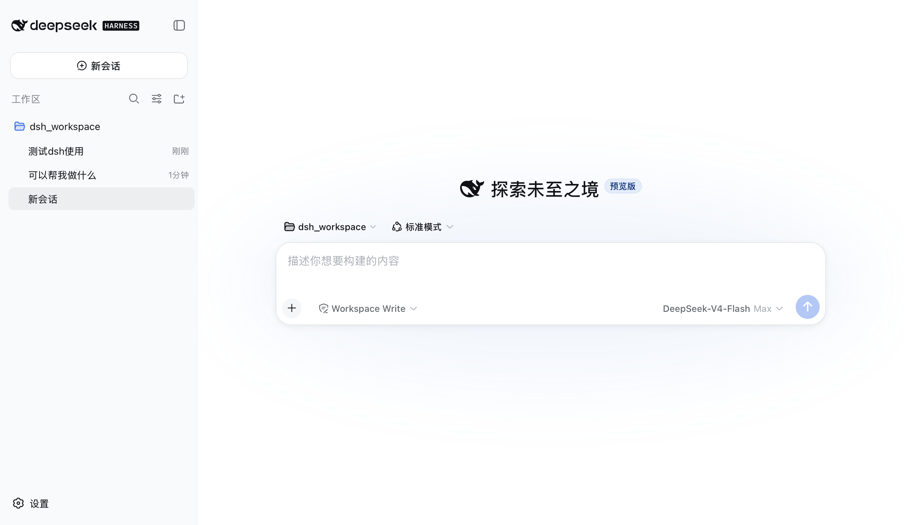

# DSH Desktop Launcher

<p align="center">
  
</p>

<p align="center">
  <strong>Run DeepSeek Harness as a native, single-window macOS app.</strong><br>
  Open the app — the server starts. Close the window — the server stops.<br>
  No terminal, no browser.
</p>

<p align="center">
  <a href="https://github.com/pixyshu/dsh-desktop-launcher/releases"></a>
  <a href="LICENSE"></a>
  
  
</p>

## Features

- **One click, one window** — launching the app boots `dsh web` in the background and shows the UI in a native window.
- **Close to hide, quit to stop** — the red button (or `⌘W`) closes the window; the app and server keep running. Quit via `⌘Q` (or Dock → Quit) stops the server gracefully (~1s). Click the Dock icon to reopen the window instantly.
- **Never kills foreign servers** — a server already running (terminal, ChatGPT, …) is reused and left alone.
- **Sessions survive restarts** — everything persists under `~/.dsh`; reopen and continue where you left off.
- **Language switching** — menu bar *Language* → English / 中文 / System default, applied live (no reload needed); the menu bar itself follows the same language.
- **Zero runtime dependencies** — macOS built-ins only (`bash`, `lsof`, `curl`), no npm packages of its own.

## Requirements

- macOS 13+
- Node.js ≥ 22.19 — the only thing installed by hand ([nodejs.org](https://nodejs.org) or `brew install node`)

## Install

**Easy way (DMG, recommended)** — download `DSH-Desktop-Launcher-<version>-macos-universal.dmg` from [Releases](https://github.com/pixyshu/dsh-desktop-launcher/releases), open it and drag **DSH.app** into *Applications*. First launch auto-installs the helper scripts to `~/.dsh` — nothing else to do (Node.js is still required).

**Build from source**:

```bash
git clone https://github.com/pixyshu/dsh-desktop-launcher
cd dsh-desktop-launcher
bash install.sh    # installs dsh if missing, builds the app, installs the scripts
```

Then drag `~/Applications/DSH.app` to your Dock.

Also available as a plain **zip** (same app, no installer layout) for scripting/automation.

## Usage

- Click the **DSH** icon → the server starts and the window opens.
- Click the red close button (or `⌘W`) → the window closes; the app and server keep running.
- Click the **Dock icon** again → the window reopens instantly.
- `⌘Q` (or Dock → Quit) → the app quits and the server stops.
- Logs: `~/.dsh/web-app-3080.log` · `~/.dsh/dsh-app-debug.log`

## How it works

On launch the app runs `~/.dsh/start-dsh.sh`; on quit (`⌘Q` / Dock → Quit) it runs `~/.dsh/stop-dsh.sh`. Closing the window keeps everything running — clicking the Dock icon just re-shows the same window. Ownership is tracked with a flag file (`.web-app-<port>.flag`) so only servers the app started are ever stopped, and shutdown targets the actual port listener rather than a recorded PID (which can drift). See [docs/testing.md](docs/testing.md) for the test matrix.

## License

[MIT](LICENSE) · Community project, not affiliated with DeepSeek.
